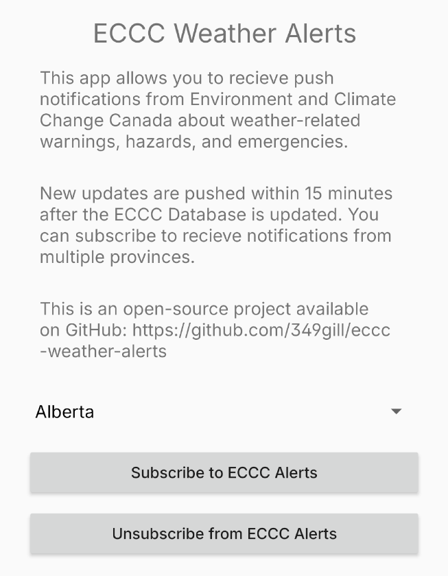
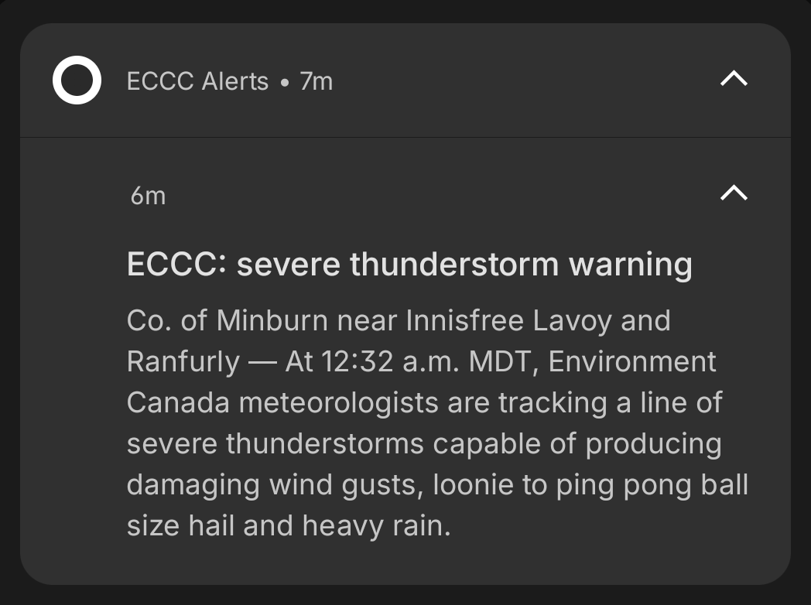

# eccc-weather-alerts
An end-to-end notification system to alert mobile users about weather emergencies in Canada

## Architecture

This service is only available on Android for now. The Android app is responsible for allowing users to sign up for push notifications.

The eccc-producer-service is responsible for fetching the latest updates from the [ECCC API](https://api.weather.gc.ca/collections/weather-alerts?lang=en) and producing each unique weather update as a Kafka event.

The eccc-notification-api is responsible for consuming the latest events from the Kafka Topic and sending push notifications via Firebase Cloud Messaging.

## Infrastructure
Both eccc-notification-api and eccc-producer-service are deployed on an Oracle Cloud Compute Instance (Virtual Machine). For the Kafka Cluster, I'm using [Aiven's](https://aiven.io/) Managed Kafka Services.

## Usage
Install the latest version from [releases](releases).
